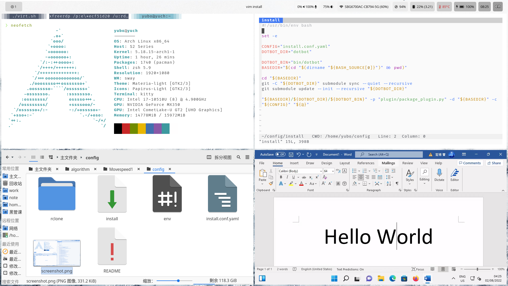

# Dotfiles

## Introduction

Welcome to my config files for raspberry pi 3b+ and Arch Linux.

- I use my raspberry pi as a samba server as well as an adblocker based on DNS spoofing.
- I use Arch Linux on daily bases. However, there are some that I must use windows,
  like `Adobe .*`, `WeChat`, and other proprietary software. So I am dual boot.

## Content

### Virtualization

I have 3 different virtual machine configurations:

- bare QEMU (current in use & recommended)
- `libvirtd` based QEMU
- and VMware based

Since I am dual booted with windows and Arch, one should consider bare QEMU which takes
advantage of that as a good option. Before you deploy that, please modify the disk
table according to your machine with `sudo parted /dev/sda unit s print`. Then you may
execute `sudo init.sh` as well as `qemu.sh` to install and start your windows virtual
machine

### X & Wayland

I use both X and Wayland because some application is just more stable on X compared to
Wayland (or only available, e.g., `xfreerdp`). However, one can disable or enable X or
Wayland environment variable by just creating an `env` file that starts with `#`
disabled`.

### Fcitx5

As everyone knows, typing CJK/Español/or any language that requires a dead key(s) is
very difficult in Linux. For example, my terminal kitty + vim won't work with this
solution (without all those environment variables). But now we can have all of those
just by executing the `install` script. I mention it here because I understand you may
not need to type those weird characters at all, so, you may wish to remove them!

### Font

- Fira Code 12px - 14px - 16px
- Google Material Icon Font
- Exhaustive list in provided at `desktop/theme/font/pkgs.yaml`

### AUR helper

- Make sure you have `yay` installed. Our script does not throw an error if failed to do so.
Implementation details are available at `plugin/package.py`. It has the following properties
  - Concurrent
  - Idempotent
  - Compatible with both `pacman` and `yay` (any other AUR implementation that adheres
    to `pacman` command line usage)
- One may group packages with dictionaries (as folders). This program always installs all
  the leaf nodes in the `pkg.yaml` file. One may specify backend and/or specify whether
  to install a batch of programs at once. Just take a look at `package.py` and you will
  see how it works.

### Future

- We will move to `Ansible` eventually. This dot file manager grows in complexity, and
  would eventually become a click and configure a new Arch Distro stuff. That being
  said, this Python script and Bash script solution works now, but eventually, growing
  bigger and bigger that we must use other solutions.
